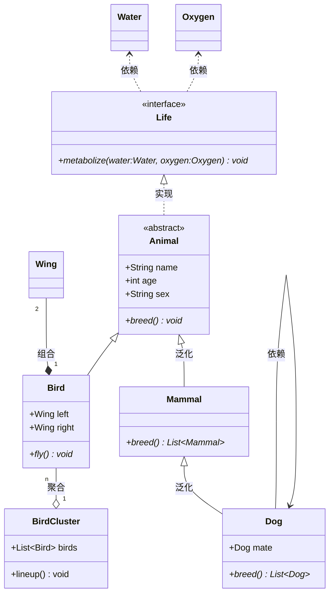
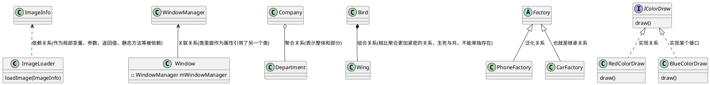

# UML类图学习

## 访问修饰符

| 符号 |  作用域     |  含义              |
| :--- | :-------- | :----------------- |
| +    | 方法、字段  | `public`           |
| -    | 方法、字段  | `private`          |
| #    | 方法、字段  | `protected`        |
| ~    | 方法、字段  | `package/friendly` |
| $    | 方法、字段  | `static`           |
| *    | 方法       | `abstract`         |
| ~~   | 类型(字段类型、返回类型、class/interface等) | `泛型` |

## 类关系


[通用UML知识](https://zhuanlan.zhihu.com/p/109655171)

## 使用与示例

[mermaid类图语法](https://www.xiehai.zone/2021-12-11-mermaind-class-diagram.html)

[plantUML语法](https://plantuml.com/zh/class-diagram)




`mermaid`源码

```shell
classDiagram
direction BT
%% 代谢基础水和氧气
class Water
class Oxygen
%% 生命接口
class Life {
    <<interface>>
    +metabolize(water:Water, oxygen:Oxygen)* void
}
Life ..> Water : 依赖
Life ..> Oxygen : 依赖
%% 动物
class Animal {
    <<abstract>>
    +String name
    +int age
    +String sex
    
    +breed()* void
}
%% 实现生命接口
Animal ..|> Life : 实现

%% 哺乳动物继承动物
class Mammal {
    +breed()* List~Mammal~
}
Mammal --|> Animal : 泛化

class Dog {
    +Dog mate
    +breed()* List~Dog~
}
%% 链接
link Dog "https://yilongdong.top" "跳转链接，到我的博客"

Dog --|> Mammal : 泛化
Dog --> Dog : 依赖

%% 鸟类继承动物，并且鸟有一双翅膀
class Wing
class Bird {
    +Wing left
    +Wing right
    +fly()* void
}
Bird "1" *-- "2" Wing : 组合
Bird --|> Animal

%% 鸟群
class BirdCluster {
    +List~Bird~ birds
    
    +lineup() void
}

BirdCluster "1" o-- "n" Bird : 聚合
```

//薪资

//岗位，工作内容

//工作时间

//稳定性

//工作地点

本科 税前11-13总包 2-3. 13-16w税前年薪

岗位+八险2金

3-6个月校招培训

1-2月轮岗期，IT线。轮岗结束后定岗。租房补贴2k，1.8, 1.6,1.3

晚上7点半免费晚餐


由于`mermaid`貌似不支持`package`无法对`cpp`中命名空间进行建模，所以选择使用`plantUML`实现`UML`建模。




