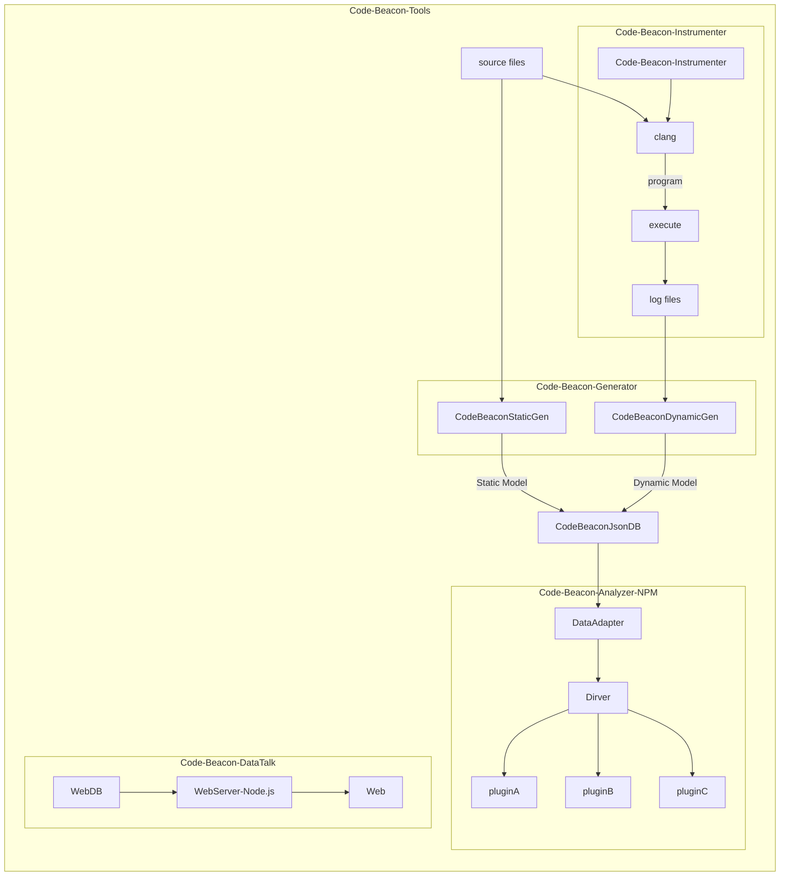
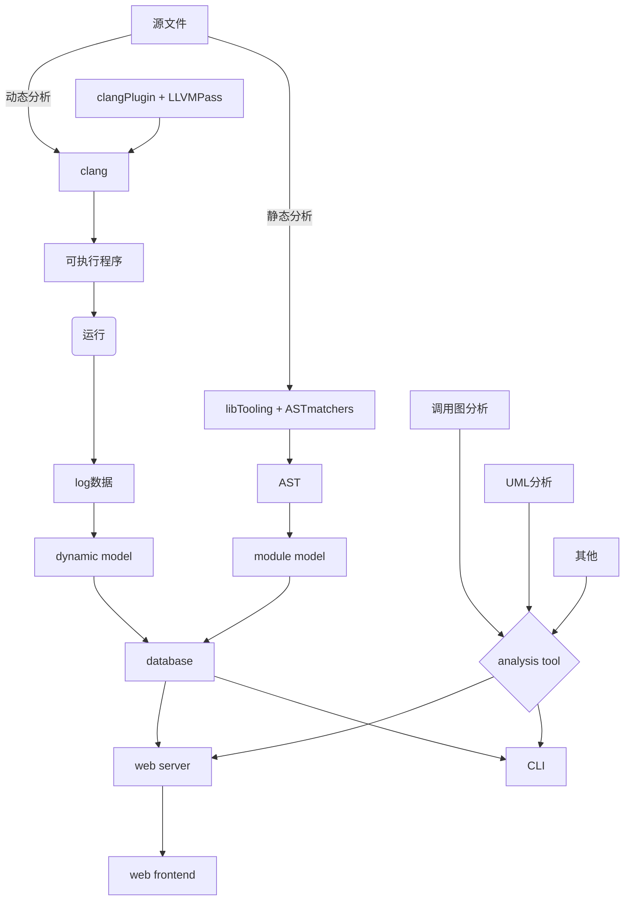

[TOC]

## 一、实习项目概况

### 1. 实习项目背景

​		当前软件开发项目迭代周期短，项目集成频繁，规模较大，纯人工的项目维护和质量保证变得难以维系。因此有必要借助代码静态分析与动态分析能力，提升项目可持续发展所需要的自动化水平。实习项目计划针对C++程序设计一个静态分析与动态分析框架，为后续毕业设计和毕业论文铺路。过程中会通过局部原型Demo的方式验证可行性，困难程度与工作量。搜集相关资料，并做知识储备。

## 二、实习工作成果及水平

以下选题自拟，工作均个人完成。

### `Code-Beacon`简介

#### 平台介绍



如上图。平台主要有四部分组成。代码灯塔插装器（`Instrumenter`），代码灯塔生成器（`Generator`），代码灯塔分析器(`Analyzer`，`npm`模块)，代码灯塔数据展示(`DataTalk`)。

##### `Code-Beacon-Instrumenter`

利用`clang-plugin`实现代码插装，以便收集程序运行时信息和状态，用以后续动态分析。

##### `Code-Beacon-Generator`

分析模型生成器。将`AST`静态数据与函数插装采集的动态数据转换为更抽象和可读的分析模型`Model`。将`Model`持久化到`Code-Beacon-DB`留待后续使用。

`Generator`包含静态分析和动态分析两部分。

###### 静态分析（`StaticGen`）：

静态分析对输入的源代码的AST进行分析，将源文件的每个编译单元转换为`TranslationUnitModel`（`Static Model`，`json`格式数据）留待之后处理使用。

###### 动态分析（`DynamicGen`）：

动态分析将此前`Code-Beacon-Instrumenter`采集的日志数据转换为统一的`Model`格式留待之后处理使用。

##### `Code-Beacon-Analyzer`

分析器预计是使用`Node.js`开发。

分析器以插件的形式进行扩展，预计此次毕设提供两个分析插件，函数调用图生成插件(静态分析)与性能分析插件(动态分析)，作为使用示例。

##### `Code-Beacon-DataTalk`

`DataTalk`是一个在线的数据汇集分析展示（监控,告警）的平台。因为不是项目核心，有时间就搞一下锦上添花，没时间就算了。计划使用`Node.js`后端（便于集成`Code-Beacon-Analyzer`），`Vue`前端，不过大概率跳票，有可能最后就是个`CLI`界面。

### 预备知识


### 系统设计


#### 核心部分原理


一个C/C++程序编译过程如上所示。我打算做的是在语法分析阶段的AST上和优化器的Pass上做改动，得到一些数据做一些插装。

运行时插装获得日志数据，静态分析也获得数据。两个数据结合都放入分析数据库。分析数据库最好能隔离语言差异和平台差异。

之后编写一些功能程序进行动态静态数据的分析，实现UML，调用树等等。

改写AST，增加自定义LLVM Pass。在编译的各个阶段生成和插入自己想要的东西。从而实现自动的UML生成，fuzzing工具以及动态分析功能，例如程序性能分析，静态和动态调用等等。

##### 抽象语法树分析

clang提供了两种方法进行抽象语法树分析：`ASTMatchers`和`RecursiveASTVisitor`，`RecursiveASTVisitor`有两种方式实现，一是`clang plugin`，二是`libtooling`

###### 方案选择

[Choosing the Right Interface for Your Application](https://clang.llvm.org/docs/Tooling.html)

###### `libClang`

libClang是一个稳定的高层次的C接口。但是不能完全控制AST。官网推荐把它作为首选。但是我想搞个框架，希望支持尽可能完全的能力....

[libclang: Thinking Beyond the Compiler](https://www.llvm.org/devmtg/2010-11/Gregor-libclang.pdf)

###### `clang plugin`

clang插件作为编译的一部分，在编译器运行时加载，很容易集成到构建环境中。这样通过替换xcode中clang编译器和加载clang插件分析AST，可以完全控制clang AST。

`clang plugin`在编译器运行时能够拿到完整的AST，但替换的clang编译器会出现很多编译问题，导致业务接入成本和解决编译问题的人力成本大大加大。

###### `libTooling`

libtooling代码本身是一个正常的C++程序，以正常的main()函数作为入口。其跟clang plugin不同，并不需要在编译器运行时加载，针对每个源程序生成相应的分析源码以及对应的AST，但同样的都是用RecursiveASTVisitor访问AST。需要定义三个类，继承自ASTFrontendAction、ASTConsumer和RecursiveASTVisitor。

libtooling分析AST无需编译，但整个过程需要逐层遍历，是由上至下的分析查找，并将系统类库和函数分析遍，还会存在重复分析，这样导致分析耗时特别长。

缺点是不怎么稳定，但是考虑到一般不至于换编译器所以就还OK。

###### `libASTMatcher`

这个是和libTooling搭配的。clang的`ASTMatcher`，速度快，可以让我们高效的匹配到我们想要的节点；其内部可以嵌套多个`ASTMatcher`，通过调用构造函数创建，或者构建成一个`ASTMatchers`的树，使得匹配更加具体准确；配合上`clang-query`的快速检验正确性，将使我们效率成倍提升。

`RecursiveASTVisitor`的方式需要递归遍历、逐层查找，不仅代码冗余，而且效率相对低下。

https://clang.llvm.org/docs/LibASTMatchersReference.html

###### 最终选择

`libTooling` + `libASTMatcher`

https://clang.llvm.org/docs/LibASTMatchersTutorial.html

https://cloud.tencent.com/developer/article/1523137

https://tech.meituan.com/2018/11/22/hades.html

https://mp.weixin.qq.com/s/XY3u-bMgsg3rKI_DHZmSTg

其实函数调用应该通过LSP协议也能获取，而且支持的语言更多。但是最后想了想还是使用clang实现吧，clang实现可以不只于函数调用等等。


##### ClangAST

###### 查看AST

```shell
# Clang by default is a frontend for many tools; -Xclang is used to pass
# options directly to the C++ frontend.
clang -Xclang -ast-dump -fsyntax-only test.cc
```

翻译单元中最顶层的都是`TranslationUnitDecl`

```cpp
int f(int x) {
  int result = (x / 42);
  return result;
}
```

对应的`AST`


###### AST Context

一个翻译单元的所有AST信息都打包在在`ASTContext`类中。它允许从[getTranslationUnitDecl](https://clang.llvm.org/doxygen/classclang_1_1ASTContext.html#abd909fb01ef10cfd0244832a67b1dd64)开始遍历整个翻译单元，或者访问Clang的已解析翻译单元的标识符表。

###### AST Nodes

[CXXBaseSpecifier](https://clang.llvm.org/doxygen/classclang_1_1CXXBaseSpecifier.html)


###### LibASTMatchers

`LibASTMatchers`提供一个创建`Clang AST`的谓词的`DSL`。

`matchers`可以形成一个树形结构，内部`matchers`可以进行更细致的匹配。

例如，可以使用[recordDecl()](https://clang.llvm.org/docs/LibASTMatchersReference.html#recordDecl0Anchor)区创建一个匹配AST中所有`class`和`union`声明的`matcher`。为了缩小范围，例如找到所有名字是`Foo`的`class`和`union`，可以在里面插入[hasName](https://clang.llvm.org/docs/LibASTMatchersReference.html#hasName0Anchor)`matcher`。类似的还可以指定派生自那个类的`matcher`。

这样`recordDecl(hasName("Foo"), isDerivedFrom("Bar"))`的调用就会返回一个匹配任意命名空间中名为`Foo`的`class`和`union`的`matcher`。

###### 如何创建`matcher`

使用匹配器的前提是了解想要匹配的AST是什么样子的。

一般创建匹配器的步骤是：

1. 找到想匹配的AST的最外部的类
2. 查看[AST Matcher Reference](https://clang.llvm.org/docs/LibASTMatchersReference.html)找到对应matcher。
3. 运行验证一下是否OK。
4. 然后再回到第二步细化内部。
5. 重复直到完成。

###### ASTMatcher的类型

Note Matchers：匹配特定类型节点   eg. objcPropertyDecl() ：匹配OC属性声明节点 

Narrowing Matchers：匹配具有相应属性的节点   eg.hasName()、hasAttr()：匹配具有指定名称、attribute的节点 AST 

Traversal Matchers：允许在节点之间递归匹配   eg.hasAncestor()、hasDescendant()：匹配祖、后代类节点

多数情况下会在Note Matchers的基础上，根据AST结构，有序交替组合narrowing Matchers、traversal matchers，直接匹配到我们感兴趣的节点

##### `clang-check`

```shell
clang-check -ast-dump -ast-dump-filter IFoo testdecl.cpp
```


##### `clang-query`


```shell
set bind-root false
set output dump
set output diag
```

#### C++类结构

##### C++成员


##### C++函数

1. C函数
2. 成员函数
3. 虚函数

函数指针 X

通过类对象调用函数

通过类对象指针调用函数

lambda函数调用与被调用 X


##### UML类图

[UML类图文档](UML类图.md)


#### 函数插装与信息记录


#### 语义分析模型

##### 静态语义分析模型

静态分析模型以一个翻译转换单元为单位。

```json
{
  
}
```


##### 动态语义分析模型

#### 插件原理

##### UML插件实现原理

##### 函数调用插件实现原理


#### 整体结构设计


​		





#### 组成部件设计


#### 功能模块设计


### 系统实现

#### 相关技术

1. [LLVM](https://llvm.org/) 编译器套件
2. [Clang](https://clang.llvm.org/) 编译器前端
3. [Plant UML](https://plantuml.com/zh/) 一种UML表示方案
4. [libTooling](https://clang.llvm.org/docs/LibTooling.html) 编译器开发的一个小框架
5. [Catapult](https://chromium.googlesource.com/catapult) 代码性能分析和可视化的一套工具，动态分析日志格式使用[这个](https://docs.google.com/document/d/1CvAClvFfyA5R-PhYUmn5OOQtYMH4h6I0nSsKchNAySU/preview)
6. [GTest](https://github.com/google/googletest) 测试框架
7. [CMake](https://cmake.org/) 构建工具
8. `chang-query` AST验证工具
9. Vue，或前后端不分离
10. `LowDB`
11. 某种web框架，例如[express](https://expressjs.com)
12. `Node.js`
13. `NPM`
14. 高性能压缩库与日志库（找不到的话需要写个轮子）

##### 平台支持

预计支持 macOS, windows, linux的常见版本，但是只会在Macbook M1上进行测试。

仅支持苹果clang和原版clang。gcc不支持。基于当前最新版`clang version 16.0.0`。

支持C++11，14标准。项目本身预计使用C++14。

虽然当前目标是仅支持C++11，14。但是还是会考虑在分析模型的层次上尽量做到语言无关，便于未来支持多种开发语言。


### 附录


#### 遇到的问题

一开始参考[LibTooling](https://clang.llvm.org/docs/LibTooling.html#linking)然后发现文档有点小问题，没有更新似乎。参考[Tutorial for building tools using LibTooling and LibASTMatchers](https://clang.llvm.org/docs/LibASTMatchersTutorial.html)比较好，这个文档是正确的比较新。

[How to link to Libtooling with cmake](https://stackoverflow.com/questions/70597372/how-to-link-to-libtooling-with-cmake)

[CMake error in FindTerminfo with clang-15 on MacOS](https://stackoverflow.com/questions/71740678/cmake-error-in-findterminfo-with-clang-15-on-macos)

[an odd bug in CommonOptionsParser](https://stackoverflow.com/questions/22577741/an-odd-bug-in-commonoptionsparser) 

报错：

```shell
Consolidate compiler generated dependencies of target CppAST
[ 50%] Building CXX object CMakeFiles/CppAST.dir/main.cpp.o
[100%] Linking CXX executable CppAST
Undefined symbols for architecture arm64:
  "typeinfo for clang::tooling::FrontendActionFactory", referenced from:
      typeinfo for std::__1::unique_ptr<clang::tooling::FrontendActionFactory, std::__1::default_delete<clang::tooling::FrontendActionFactory> > clang::tooling::newFrontendActionFactory<clang::SyntaxOnlyAction>()::SimpleFrontendActionFactory in main.cpp.o
ld: symbol(s) not found for architecture arm64
clang: error: linker command failed with exit code 1 (use -v to see invocation)
make[2]: *** [CppAST] Error 1
make[1]: *** [CMakeFiles/CppAST.dir/all] Error 2
make: *** [all] Error 2

```

分析：

可以看到未定义类型的`typeinfo`。添加link目录后依然如此。查找资料发现llvm没有开启运行时类型识别，所以没有`typeinfo`。然而我们的程序默认是开启`RTTI`的，所以只需要关闭`RTTI`就可以了。参考[Getting Linking error When building xunused with llvm ](https://github.com/mgehre/xunused/issues/9)

解决：

```cmake
target_compile_options(CppAST PRIVATE -fno-rtti)
```


报错：

```shell
/Library/Developer/CommandLineTools/SDKs/MacOSX12.3.sdk/usr/include/wchar.h:89:10: fatal error: 'stdarg.h' file not found
#include <stdarg.h>
```

原因：

编译时没有设置默认系统根路径

解决方式：

最终发现是用源码编译，增加` -DDEFAULT_SYSROOT="$(xcrun --show-sdk-path)"`，并在LLVM工程上开发，可以解决这个问题。参考[How to build LLVM (clang,clang++) for Apple M1?](https://stackoverflow.com/questions/65293299/how-to-build-llvm-clang-clang-for-apple-m1)

```cmake
cmake -G Ninja -S /Users/dongyilong/clang-llvm/llvm-project/llvm -B /Users/dongyilong/clang-llvm/llvm-project/release-build/clang-tools-extra -DLLVM_ENABLE_PROJECTS="clang;clang-tools-extra" -DCMAKE_BUILD_TYPE=Release -DDEFAULT_SYSROOT="$(xcrun --show-sdk-path)"
```

项目外也可以开发，但是有缺失头文件问题。这个可能要仔细查阅LLVM项目cmake怎么搞的。

[开发Clang LibTooling工具的三种方式](https://www.toutiao.com/article/7131195731221676576/)

## 三、实习收获

1. 学习了解了很多技术，扩展技术视野。
2. 提高了软件设计能力，架构规划能力。
3. 练习了文档编写能力，提高表达能力。

## 四、对实习工作建议

1. 降低对实习报告的字数要求。建议下调两千字。
2. 放宽对实习报告的结构要求。建议允许学生自拟。
3. 建议改为实习周报，而非实习日志，减轻负担。
4. 这些实习日志和总结过于形式化，建议取消或者改个形式。

